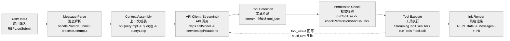
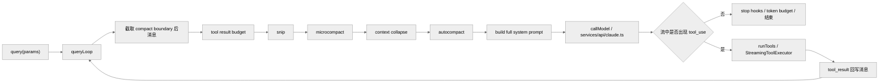

# `query()` 主循环与请求构造

本文将 `query()` 作为多轮状态机来分析，覆盖请求前上下文治理、流式模型调用、工具回流与错误恢复。

## 1. 定义

`src/query.ts` 里的 `query()` 不是“调用一次模型 API”的薄包装，而是整个系统的对话执行状态机。

一次用户 turn 在这里可能经历：

1. 请求前上下文处理。
2. 向模型发起 streaming 请求。
3. 收到 `tool_use`。
4. 执行工具并回写 `tool_result`。
5. 继续下一轮模型请求。
6. 在输出超限、上下文过长、stop hooks、token budget 等场景下恢复或结束。

## 2. 高层流程图

### 2.1 请求生命周期调用链示意图

下图展示“**从用户输入到终端渲染**”的调用链；这一视角与后文 `queryLoop()` 的内部状态机不同。



补充说明如下：

- 图里把 `tool_result` 回写、消息追加、再次进入 `queryLoop` 的过程折叠成了 `Tool Execute -> API Client` 这条回环。
- `Ink Render` 在真实运行时并不是最后一步才发生；streaming 文本、tool progress、权限确认 UI 都会持续驱动 REPL/Ink 更新。图里只是把它抽象成“用户最终看到的渲染出口”。

### 2.2 `query()` 内部状态机图



## 3. `query()` 与 `queryLoop()` 的关系

关键代码：

- `src/query.ts:219-238`
- `src/query.ts:241-279`

`query()` 外层只做一件特别重要的事：

- 调用 `queryLoop(params, consumedCommandUuids)`
- 正常返回后，把已消费队列命令标记为 completed

真正复杂的逻辑全部在 `queryLoop()`。

## 4. `queryLoop()` 的 state 说明它是一个“多轮状态机”

关键代码：`src/query.ts:263-279`

内部 state 包括：

- `messages`
- `toolUseContext`
- `maxOutputTokensOverride`
- `autoCompactTracking`
- `stopHookActive`
- `maxOutputTokensRecoveryCount`
- `hasAttemptedReactiveCompact`
- `turnCount`
- `pendingToolUseSummary`
- `transition`

这些字段已经说明：

- 这里的“turn”不是用户 turn，而是 query 内部递归轮次。
- 一次 query 可能自己继续好几轮。

## 5. 每一轮开始前先做哪些事

关键代码：`src/query.ts:323-460`

## 5.1 发 `stream_request_start`

`src/query.ts:337`

这是给上层 UI/SDK 的控制事件，表示一次新的 API 请求即将开始。

## 5.2 生成 query chain tracking

`src/query.ts:346-363`

这里会生成：

- `chainId`
- `depth`

用于：

- telemetry
- 多轮/递归查询链追踪

## 5.3 从 compact boundary 之后截消息

`src/query.ts:365`

说明：

- REPL 的全量 scrollback 不等于每次送给模型的上下文。
- compact boundary 是“上下文切断点”。

## 5.4 工具结果预算裁剪

`src/query.ts:369-394`

这一步会对 tool result 做预算控制，避免某些工具结果膨胀到把上下文撑爆。

这一层有两个特征：

- 严格来说，这一步已经是“上下文治理”的第一层，只是它针对的是 **单条 tool result 的尺寸上限**，还没进入后面四种更系统的压缩/折叠机制。
- 用户常把后面的 `snip`、`microcompact`、`context collapse`、`autocompact` 说成“四种同时工作”的压缩，但源码里它们更像 **按顺序尝试的梯度体系**，不是每轮都全部生效。

## 5.5 `snip`

`src/query.ts:396-410`

它是第一层上下文治理：

- 如果历史过长，先做轻量 snip。
- 可能产出一个 boundary message。

再往代码里看，能确认几件更具体的事：

- `query()` 直接调用的是 `snipCompactIfNeeded(messagesForQuery)`，返回 `messages`、`tokensFreed`、`boundaryMessage` 三样东西。
- `tokensFreed` 会继续传给 `autocompact`。`query.ts` 和 `autoCompact.ts` 的注释明确说了，`tokenCountWithEstimation()` 看不到 snip 释放出来的 token，所以要手工减回去，不然会误触发 blocking / autocompact。
- `sessionStorage.ts` 里的 `applySnipRemovals()` 说明 snip 不是“生成摘要替换旧消息”，而是 **删除中间若干消息并重连 parentUuid**。注释还专门对比了 `compact_boundary` 和 snip：前者截 prefix，后者删 middle ranges。
- `utils/messages.ts` 里的 `getMessagesAfterCompactBoundary()` 默认还会再走一次 `projectSnippedView()`，说明 REPL scrollback 可以保留完整历史，但 API 视图默认要把 snipped messages 过滤掉。
- `QueryEngine.ts` 的注释进一步说明：REPL 保留全量历史做 UI scrollback，headless/SDK 路径则会在 snip replay 后直接裁掉内存中的消息，避免长会话持续膨胀。

代码可以确认 `HISTORY_SNIP` 属于“最细粒度、直接删消息、不做摘要”的机制；但当前反编译树里的 `src/services/compact/snipCompact.ts` / `snipProjection.ts` 仍是 stub，具体筛选规则无法仅凭当前仓库完整还原。

## 5.6 `microcompact`

`src/query.ts:412-426`

这是第二层更细粒度压缩，重点不是全局总结，而是对特定 tool result 做更细的压缩或缓存编辑。

### 5.6.0 “三层压缩”可以当口语总结，但不是源码原貌

把运行时最常被提到的压缩链概括成：

1. `microcompact`
2. `autocompact`
3. 最后退到完整 AI summary

这一说法只适合作为 **粗粒度速记**。代码级表述应改为：

- 在 `query.ts` 的真实顺序里，`microcompact` 前面还有 `tool result budget` 和可选的 `snip`。
- `microcompact` 后面还有可选的 `context collapse`，它在某些模式下会直接接管 headroom 管理，并 suppress proactive autocompact。
- `autocompact` 不是单独一层“压缩器”，而是一个 orchestration gate：阈值到了以后，先试 `SessionMemory`，失败后才走传统 `compactConversation()`。
- “让对话永不超限”更接近产品目标，不是数学保证。真实代码里仍然保留了 blocking limit、reactive compact、prompt-too-long retry 等失败恢复分支。

源码实际分成两条活路径：

### 5.6.1 time-based microcompact：直接改消息内容

`src/services/compact/microCompact.ts`

`microcompactMessages()` 先检查 `maybeTimeBasedMicrocompact()`：

- 如果离上一次 assistant 消息已经超过阈值，说明服务端 prompt cache 大概率已经冷掉。
- 这时它不会做 cache editing，而是直接把旧的 `tool_result.content` 替换成 `[Old tool result content cleared]`。
- 它会保留最近 `N` 个 compactable tool result，清掉更老的那些。
- 因为它已经改了 prompt 内容，还会顺手 `resetMicrocompactState()` 并通知 prompt-cache break detection，避免把这次 cache drop 误报成异常。

这表明 **并非所有 microcompact 都“不改消息内容”**。

### 5.6.2 cached microcompact：不改本地消息，改 API cache 视图

同一个文件里，cached path 的行为才接近“cache 层编辑”：

- 只有 `CACHED_MICROCOMPACT` 打开、模型支持、并且是 `repl_main_thread` 主线程时才会走。
- 它会收集可 compact 的 `tool_use_id`，把要删的工具结果放进 `pendingCacheEdits`。
- `services/api/claude.ts` 的 `addCacheBreakpoints()` 会在真正发请求时插入 `cache_edits` block，并给旧的 `tool_result` 加 `cache_reference`。
- 本地 `messages` 不会改；真正发生的是 **API 请求体里多了 cache editing 指令**。
- `query.ts:869-887` 在 API 返回后，才根据 usage 里的 `cache_deleted_input_tokens` 计算本次实际删掉了多少 token，再补发 boundary message。

这里也能看出一个重要细节：

- `cache_deleted_input_tokens` 不是“编辑动作本身”，而是 **API 回来的计量结果**。
- 真正让 API 少算这些 token 的，是请求里的 `cache_edits` / `cache_reference` 结构，而不是这个 usage 字段本身。

因此，`Microcompact` 不能统一描述为“只在缓存层删 token、不改消息内容”。代码上应区分为：

- **cached microcompact** 是 cache-layer editing
- **time-based microcompact** 是 content-clearing

## 5.7 `context collapse`

`src/query.ts:428-447`

这里的设计非常重要：

- collapse 不是简单把 REPL messages 改写掉。
- 它更像“投影视图 + commit log”。

它属于读取时投影的上下文层，而不是简单消息替换。

当前仓库虽然缺少主体实现，但周边代码已经清楚暴露了设计意图：

- `query.ts` 直接写明：collapse summary 不住在 REPL message array 里，而是住在 collapse store；每次 turn 入口都靠 `projectView()` 重放 commit log。
- `commands/context/context.tsx` 和 `context-noninteractive.ts` 都会先 `projectView(view)`，注释直接说：不做这一步，`/context` 看到的 token 会比模型真正看到的多很多。
- `utils/sessionStorage.ts` 里有 `recordContextCollapseCommit()` 和 `recordContextCollapseSnapshot()`，会把 collapse commit 以及 staged queue / spawn state 落到 transcript 里；注释还特别强调“Array, not Map — commit order matters (nested collapses)”。
- resume 侧也会读取这些 `marble-origami-commit` / snapshot entries，并在 compact boundary 后丢弃失效 commit，避免 `/context` 统计过高。

代码显示，`CONTEXT_COLLAPSE` 接近“commit log 归档 + 投影视图”的结构；同时需要注意两点：

1. 这是从 `query.ts`、`sessionStorage.ts`、`/context` 代码和注释里推出来的，因为 `src/services/contextCollapse/*` 在当前反编译树里基本都是 stub。
2. 它和 autocompact 不是平行兜底关系。`autoCompact.ts` 明确写了：**当 context collapse runtime 打开时，proactive autocompact 会被 suppress**，因为 collapse 自己就是 context management system。

## 5.8 `autocompact`

`src/query.ts:453-468`

这是更强的一层压缩，如果触发，会生成新的 post-compact messages 作为接下来的上下文。

但它也不是“把整个历史压成一段话”这么简单。

### 5.8.1 触发阈值不是固定 87%

将触发阈值概括为“接近上下文窗口的 87%”，在当前源码里 **不成立为固定常量**。

`autoCompact.ts` 的真实计算是两步：

- 先算 `effectiveContextWindow = getContextWindowForModel(model) - reservedTokensForSummary`
- 再算 `autoCompactThreshold = effectiveContextWindow - 13_000`

这里的 `reservedTokensForSummary` 也不是固定值，而是：

- `min(getMaxOutputTokensForModel(model), 20_000)`

所以，真正的 autocompact 触发点是：

> **有效上下文窗口减去 13,000 token buffer**

而不是一个在所有模型、所有配置、所有 beta 组合下都恒定的 87%。如果模型切到 1M context、max output cap 变化、或者用户用环境变量覆盖 window，这个百分比都会变。

因此，“窗口大小 - 13,000 buffer”只在把“窗口”理解成 **effective context window** 时才算基本正确；如果把它理解成原始 context window，就不准确。

### 5.8.2 源码里确实有 3 次失败熔断器

这一点是对的，而且实现得很直接：

- `autoCompact.ts` 定义了 `MAX_CONSECUTIVE_AUTOCOMPACT_FAILURES = 3`
- `AutoCompactTrackingState` 里会保存 `consecutiveFailures`
- `autoCompactIfNeeded()` 一进来就先检查这个计数；达到 3 次后，这个 session 里后续 proactive autocompact 会直接跳过
- 成功 compact 一次后，失败计数会被重置为 `0`

这就是一个很典型的 circuit breaker，用来避免 prompt 已经 irrecoverably too long 时，每一轮都反复打一个注定失败的 compact 请求。

### 5.8.3 “完全压缩”先走 `SessionMemory`，再回退到模型总结

`autoCompact.ts` 和 `compact.ts` 说明了更完整的链路：

- `autoCompactIfNeeded()` 先做阈值判断。
- 真正触发后，**先试 `trySessionMemoryCompaction()`**。如果 session memory 可用，会优先保留 `lastSummarizedMessageId` 之后的消息，把 session notes 作为 compact summary 的主体。
- 只有 session memory compact 走不通时，才回退到传统 `compactConversation()`。
- `compactConversation()` 不是简单生成一句话，而是调用专门的 compact prompt，得到结构化 summary，然后构造：
  - `boundaryMarker`
  - `summaryMessages`
  - post-compact file / plan / MCP / tool delta attachments
  - session start hook 结果

若按层级概括，可写为：

1. `microcompact`
2. `autocompact gate`
3. gate 命中后先试 `SessionMemory compact`
4. 再不行才进入 legacy full compact summary

### 5.8.4 `NO_TOOLS_PREAMBLE` 确实属于 legacy full compact summary

这一点在 `src/services/compact/prompt.ts` 里是直接可见的：

- `NO_TOOLS_PREAMBLE` 会被 `getCompactPrompt()` 和 `getPartialCompactPrompt()` 拼到 compact prompt 的最前面
- 它明确要求 compaction agent 只能输出纯文本 `<analysis> + <summary>`，不要调用任何工具

而在执行链上：

- `compactConversation()` 会创建 `summaryRequest = createUserMessage({ content: getCompactPrompt(...) })`
- 然后把这个 `summaryRequest` 送进 `streamCompactSummary()`
- forked-agent 路径还会额外通过 `createCompactCanUseTool()` 把所有 tool use 一律 deny，进一步把“只许文本总结”落实成权限策略

因此，“完全压缩——AI 总结 `NO_TOOLS_PREAMBLE`”只对应 **legacy compact summary** 这条路径，不覆盖前面的 `SessionMemory` compact。

所以 autocompact 的代码级事实更接近：

> 它是最后的重手段，但结果不是“一坨摘要文本”，而是“compact boundary + summary message + 若干恢复上下文用的附件/钩子结果”。

## 6. 请求前的系统提示词是最后拼出来的

关键代码：

- `src/query.ts:449-450`
- `src/utils/queryContext.ts:44-73`

`queryLoop` 在请求前会得到：

- 基础 `systemPrompt`
- `systemContext`

然后通过 `appendSystemContext(systemPrompt, systemContext)` 得到最终发送给模型的 full system prompt。

### 6.1 为什么 system prompt 不在更前面就一次性定死

因为：

- `systemContext` 可能依赖 trust、环境、当前状态。
- `appendSystemPrompt`、agent prompt、custom prompt、memory mechanics 都可能参与最终拼装。

## 7. 进入 API 调用前的 setup

关键代码：`src/query.ts:551-580`

这一段会准备：

- `assistantMessages`
- `toolResults`
- `toolUseBlocks`
- `needsFollowUp`
- streamingToolExecutor
- 当前 permission mode 对应的运行模型

一个很关键的点是：

- 当前实际模型可能不是配置里的名义模型，而会被 permission mode、上下文长度等因素影响。

## 8. `callModel` 如何真正构造请求

关键文件：`src/services/api/claude.ts`

重点代码：

- `src/services/api/claude.ts:1358-1379`
- `src/services/api/claude.ts:1538-1728`
- `src/services/api/claude.ts:1777-1833`

## 8.1 系统提示词拼装

在真正发请求前，`claude.ts` 会再次在 system prompt 前后追加一批系统块：

- attribution header
- CLI system prompt prefix
- advisor instructions
- chrome tool search instructions

然后用 `buildSystemPromptBlocks(...)` 处理成 API 需要的 block 结构。

### 8.1.1 这解释了为什么 prompt cache 如此敏感

因为：

- 任何一个系统块、beta header、tool schema 的变化，都可能导致缓存前缀失效。

## 8.2 请求参数不只是 model/messages/system

`paramsFromContext(...)` 里会构造：

- `model`
- `messages`
- `system`
- `tools`
- `tool_choice`
- `betas`
- `metadata`
- `max_tokens`
- `thinking`
- `temperature`
- `context_management`
- `output_config`
- `speed`

这说明请求构造层承担了大量策略组合工作：

- prompt cache
- thinking 配置
- structured outputs
- task budget
- fast mode
- context management

## 8.3 streaming 请求是通过 `anthropic.beta.messages.create(...).withResponse()`

关键代码：`src/services/api/claude.ts:1822-1833`

这里会：

- 设置 `stream: true`
- 传入 signal
- 可能带 client request id header
- 拿 response headers、request id 和 raw stream

源码注释还明确提到：

- 使用 raw stream 是为了避免 SDK 的 O(n²) partial JSON parsing 成本。

这又是一个典型的生产级性能优化点。

## 9. streaming 过程中 query 在干什么

关键代码：`src/query.ts:652-864`

这一段是主循环最核心的实时路径。

## 9.1 每条 message 先决定“要不要立即 yield”

有些错误消息会先被 withheld，例如：

- prompt too long 可恢复错误
- media size error
- `max_output_tokens`

原因是：

- 系统想先尝试恢复。
- 如果恢复成功，用户就不需要看到中间错误。

## 9.2 assistant 消息里的 `tool_use` 会被提取出来

`src/query.ts:829-845`

如果 assistant content 里有 `tool_use` block：

- 追加到 `toolUseBlocks`
- 标记 `needsFollowUp = true`
- 如果启用流式工具执行，立刻交给 `StreamingToolExecutor`

## 9.3 流式工具执行可以边收边跑

这意味着系统不必等整条 assistant 完整结束，才能开始执行所有工具。

从产品体验看，这能显著降低：

- 工具启动延迟
- 长响应中的空转时间

## 10. 如果没有 `tool_use`，query 怎么结束

关键代码：`src/query.ts:1185-1357`

在没有后续工具需要执行时，系统还要经过几道结束前检查：

- `max_output_tokens` 恢复
- API error 短路
- stop hooks
- token budget continuation

### 10.1 `max_output_tokens` 恢复机制

如果命中输出 token 限制：

1. 可能先把默认 cap 从 8k 升到 64k 再重试。
2. 如果还不够，会注入一条 meta user message，让模型直接续写，不要道歉不要 recap。
3. 超过恢复上限后才真正把错误抛给用户。

这是一种典型的“会话连续性优先”策略。

### 10.2 stop hooks 可以阻止继续

`handleStopHooks(...)` 的返回值可以：

- prevent continuation
- 返回 blocking errors

从而阻止 query 继续递归。

### 10.3 token budget continuation

如果当前 turn 的 token 花费达到了预算阈值，系统可以插入一条 meta user message，让模型把剩余工作拆小继续。

这进一步说明 query 的终止条件不是单一的 API stop reason。

## 11. 如果有 `tool_use`，如何进入下一轮

关键代码：`src/query.ts:1363-1435`

流程是：

1. 选择 `StreamingToolExecutor.getRemainingResults()` 或 `runTools(...)`
2. 消费每个 tool update
3. 把得到的 tool result message 再转成适用于 API 的 user message
4. 更新 `updatedToolUseContext`
5. 生成 tool use summary
6. 把新的 messages 与 context 带入下一轮 `continue`

这就形成了：

`assistant(tool_use) -> user(tool_result) -> assistant(next turn)`

## 12. `runTools()` 为何还要分并发安全批次

这个属于工具系统的内容，但和 query 强耦合。

`runTools()` 会按工具的 `isConcurrencySafe` 把工具块分成：

- 只读可并发批
- 有状态/非安全工具单独串行批

这样做能在保证正确性的前提下尽量并发执行 read-only 工具。

## 13. Query 与请求构造之间的边界

可以这样理解：

- `query.ts` 负责“什么时候调用模型、什么时候执行工具、什么时候继续”。
- `services/api/claude.ts` 负责“这次调用模型到底发什么参数、怎么处理 streaming 原始协议”。

前者是会话状态机，后者是模型协议适配器。

## 14. `fetchSystemPromptParts()` 的位置很关键

关键代码：`src/utils/queryContext.ts:44-73`

它只负责获取三块上下文原料：

- `defaultSystemPrompt`
- `userContext`
- `systemContext`

它不直接决定最终 prompt 形态。最终组装留给 REPL 或 QueryEngine。

这是一种很好的分层：

- 原料获取
- 最终 prompt 拼装

分开。

## 15. 关键源码锚点

| 主题 | 代码锚点 | 说明 |
| --- | --- | --- |
| query 入口 | `src/query.ts:219-238` | generator 外层包装 |
| queryLoop 初始 state | `src/query.ts:241-279` | 多轮状态机的状态定义 |
| 请求前上下文治理 | `src/query.ts:365-468` | budget, snip, microcompact, collapse, autocompact |
| API streaming 调用 | `src/query.ts:652-864` | `deps.callModel(...)` 的主循环 |
| max token 恢复与 stop hooks | `src/query.ts:1185-1357` | query 结束前的恢复/阻断策略 |
| 工具回流 | `src/query.ts:1363-1435` | `tool_use -> tool_result -> 下一轮` |
| 系统提示词拼装 | `src/services/api/claude.ts:1358-1379` | system prompt block 的最终构造 |
| 请求参数生成 | `src/services/api/claude.ts:1538-1728` | thinking、betas、context_management、output_config |
| 真正发请求 | `src/services/api/claude.ts:1777-1833` | raw streaming create + response headers |

## 16. 一段伪代码复原

下面这段伪代码比逐行读更容易把握 query 的灵魂：

```ts
while (true) {
  messagesForQuery = compactBoundaryTail(messages)
  messagesForQuery = applyToolResultBudget(messagesForQuery)
  messagesForQuery = snipIfNeeded(messagesForQuery)
  messagesForQuery = microcompact(messagesForQuery)
  messagesForQuery = collapseContextIfNeeded(messagesForQuery)
  messagesForQuery = autocompactIfNeeded(messagesForQuery)

  response = await callModel({
    messages: prependUserContext(messagesForQuery),
    systemPrompt: fullSystemPrompt,
    tools,
  })

  if (!response.hasToolUse) {
    maybeRecoverFromErrors()
    maybeRunStopHooks()
    maybeContinueForBudget()
    return
  }

  toolResults = await runTools(response.toolUses)
  messages = [...messagesForQuery, ...assistantMessages, ...toolResults]
}
```

## 17. 总结

`query()` 是这个工程真正的运行时内核。它把：

- 上下文治理
- 模型请求
- 工具执行
- 递归继续
- 错误恢复

统一到一个 generator 状态机中。

REPL 负责交互控制，`query.ts` 负责会话执行，`services/api/claude.ts` 负责模型协议组装与调用。
