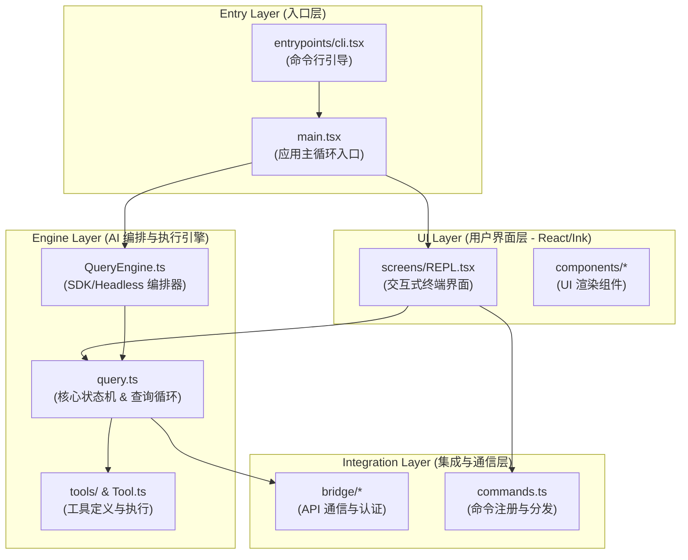
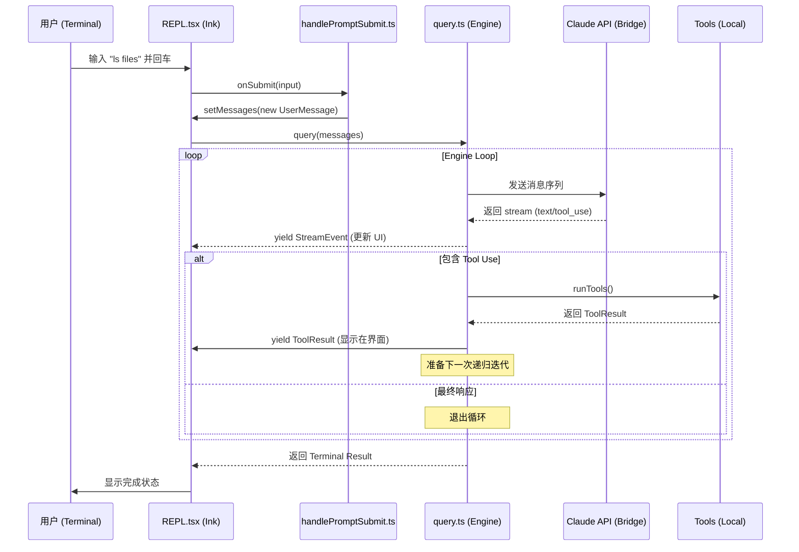

# 1. Claude Code 核心工程架构深度剖析

本报告对 `claude-code` 项目的源代码进行了深入分析，揭示了其作为现代 AI 驱动的命令行工具（CLI）的高层架构设计、模块化职责以及核心业务流。

## 1.1. 整体架构概览

`claude-code` 采用了分层架构设计，将用户界面、业务逻辑编排、AI 核心引擎和底层基础设施清晰地解耦。



## 1.2. 核心组件深度解析

### 1.2.1. `entrypoints/cli.tsx`: 启动引导层
这是整个应用的物理入口。其核心职责是进行极简的参数预解析，以决定启动路径。
- **快路径 (Fast-path)**: 针对 `--version` 或 `--help` 等命令，直接输出结果并退出，不加载笨重的业务模块。
- **模式选择**: 根据参数（如 `-p`, `ssh`, `remote-control`）选择是进入交互式 REPL 还是非交互式 SDK 模式。
- **环境初始化**: 设置 Node.js 内存限制、处理特殊的系统环境变量。

### 1.2.2. `main.tsx`: 应用主逻辑入口
`main.tsx` 是业务逻辑的逻辑起点，负责复杂的环境初始化和依赖组装。
- **初始化序列**: 执行 MDM 配置读取、Keychain 预取、Telemetry 初始化和 GrowthBook 特性开关加载。
- **Commander 集成**: 使用 `commander` 库定义了庞大的命令行选项组。
- **模式分发**:
    - **交互模式**: 调用 `launchRepl` 启动 Ink 渲染。
    - **非交互模式 (`-p`)**: 使用 `QueryEngine` 或直接调用 `print.ts` 中的逻辑。

### 1.2.3. `screens/REPL.tsx`: 交互式核心
这是 TUI (Terminal UI) 的核心组件，作为一个大型 React 组件管理整个会话的 UI 状态。
- **状态管理**: 维护 `messages` 列表、输入框状态 (`inputValue`)、加载状态 (`isLoading`) 等。
- **查询触发**: 当用户提交输入时，通过 `onSubmit` -> `onQuery` -> `onQueryImpl` 触发。
- **流式处理**: `onQueryEvent` 监听 `query()` 生成器的输出，实时更新 UI。
- **并发控制**: 使用 `QueryGuard` 确保同一时间只有一个主查询在运行。

### 1.2.4. `QueryEngine.ts`: SDK 与非交互式编排
`QueryEngine` 是对 `query.ts` 的高层封装，主要用于 SDK 调用和无界面模式。
- **状态持有**: 内部持有 `mutableMessages`，管理多轮对话的上下文。
- **配置驱动**: 通过 `QueryEngineConfig` 接收工具集、命令集和环境上下文。
- **核心接口**: `submitMessage(prompt)`，这是一个异步生成器，输出 `SDKMessage` 序列。

### 1.2.5. `query.ts`: 核心状态机引擎
这是整个项目的“心脏”，实现了与 AI 模型交互的复杂循环。
- **核心函数**: `async function* query(params: QueryParams)`。
- **循环机制**:
    1. **Context Assembly**: 组装 System Prompt、User Context 和历史消息。
    2. **Compaction**: 执行 `autocompact`（自动压缩）和 `snip`（剪枝）以管理上下文窗口。
    3. **Model Call**: 调用 `callModel` 获取 AI 响应。
    4. **Tool Execution**: 识别 `tool_use` 块，通过 `runTools` 并发或顺序执行本地工具。
    5. **Recursive Iteration**: 将工具结果回填至消息列表，并决定是否需要开启新一轮迭代（`next_turn`）。

## 1.3. 核心业务流程详解

### 1.3.1. 交互式查询流程图
以下是用户在终端输入 prompt 后的处理全过程：



## 1.4. 关键数据结构分析

### 1.4.1. 消息模型 (`types/message.ts`)
项目定义了丰富的消息类型来支撑复杂的交互逻辑：
- `UserMessage`: 用户输入或工具执行结果。
- `AssistantMessage`: 模型输出，可能包含 `thinking` 块或 `tool_use` 块。
- `SystemMessage`: 系统生成的通知、错误或环境注入。
- `ProgressMessage`: 工具执行过程中的中间进度。

### 1.4.2. 工具接口 (`Tool.ts`)
所有本地能力都抽象为 `Tool` 接口：
```typescript
export interface Tool {
  name: string;
  description: string;
  inputSchema: ZodSchema;
  call: (input: any, context: ToolUseContext) => Promise<ToolResult>;
  // ... 其他元数据，如是否为只读、最大结果大小等
}
```

## 1.5. 架构设计亮点

1.  **React in Terminal**: 通过 `Ink` 库将 React 的声明式编程模型引入终端，极大地简化了复杂状态（如工具执行进度、流式文本）的渲染逻辑。
2.  **异步生成器驱动**: `query` 引擎完全基于 `AsyncGenerator` 实现，天然支持流式响应，并允许 UI 层在 AI 思考过程中插入中间状态。
3.  **双路径架构**: 针对交互式（REPL）和非交互式（SDK）共享同一个核心引擎（`query.ts`），但在编排层分别提供了 `REPL.tsx` 和 `QueryEngine.ts`，实现了完美的关注点分离。
4.  **弹性上下文管理**: 面对长对话，系统集成了自动压缩（Auto-compact）、剪枝（Snip）和微压缩（Micro-compact）机制，确保始终处于模型上下文窗口的最优状态。
