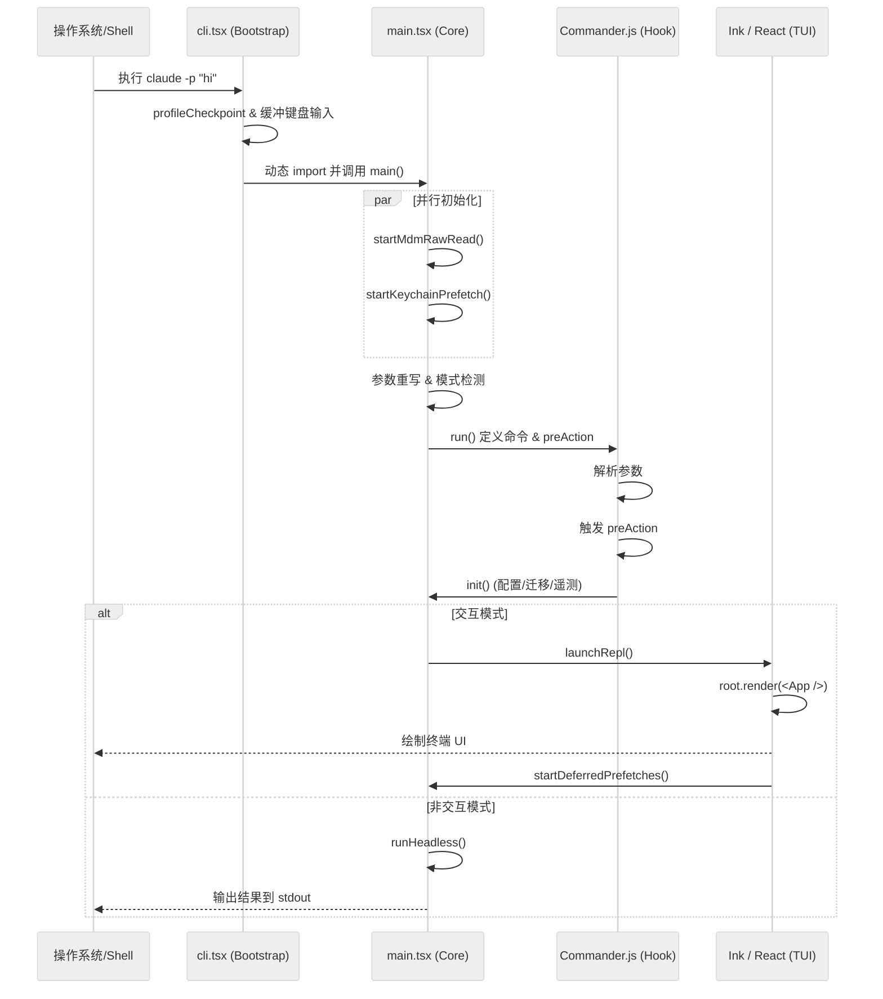

# 2. 启动流程深度解析

本报告对 `claude-code` 的启动流程进行代码级的深度分析，追踪从用户执行 `claude` 命令到交互式 REPL 界面呈现的全过程。

## 2.1. 启动入口：Bootstrap 阶段 (`cli.tsx`)

`claude-code` 的执行入口并非逻辑最复杂的 `main.tsx`，而是轻量级的 `src/entrypoints/cli.tsx`。这种设计是为了实现“快路径（Fast-path）”响应。

### 核心职责：
1.  **性能分析启动**：第一时间调用 `profileCheckpoint('cli_entry')` 记录启动耗时。
2.  **快路径处理**：对于 `--version` (-v) 等简单命令，直接输出结果并退出，完全不加载后续数千行的重量级模块。
3.  **特殊模式分流**：处理 `daemon`（守护进程）、`remote-control`（远程控制）、`mcp` 专用模式等。
4.  **早期输入捕获 (`startCapturingEarlyInput`)**：这是一个非常关键的设计。在 Node.js 忙于加载和解析后续庞大的 JS 模块时，程序已经开始监听并缓冲用户的键盘输入，确保用户在界面还没出来前输入的字符不会丢失。
5.  **动态加载主逻辑**：完成初步检查后，通过 `await import("../main.jsx")` 动态加载主模块，这避免了主模块顶部的 side-effects 阻塞 bootstrap 阶段。

## 2.2. 环境预备阶段 (`main.tsx: main()`)

进入 `main.tsx` 的 `main()` 函数后，程序开始进行底层环境的初始化。

### 关键步骤：
1.  **并行 I/O 加速**：
    *   `startMdmRawRead()`：后台读取企业 MDM 策略。
    *   `startKeychainPrefetch()`：后台预读密钥链（OAuth Token、API Key）。
    这两个任务在主线程继续执行后续逻辑时，在后台线程并行运行，减少了后续同步读取导致的事件循环阻塞（约节省 60-100ms）。
2.  **安全加固**：设置 `process.env.NoDefaultCurrentDirectoryInExePath = '1'`，防止 Windows 下的 PATH 劫持攻击。
3.  **参数重写 (Argv Rewriting)**：
    *   识别 `cc://` 协议、`claude ssh <host>` 或 `claude assistant`。
    *   将这些高级指令重写为内部可识别的参数组合，从而复用主命令的逻辑，同时保留完整的 TUI 功能。
4.  **交互模式判断**：通过检查 `-p`、`--init-only` 或 `stdout.isTTY` 确定 `isInteractive` 状态。
5.  **配置预加载 (`eagerLoadSettings()`)**：在正式进入命令解析前，预先加载标志位相关的配置。

## 2.3. 命令定义与延迟初始化 (`main.tsx: run()`)

`run()` 函数利用 `Commander.js` 构建 CLI 接口，其核心亮点在于 `preAction` 钩子的使用。

### `preAction` 延迟加载机制：
`program.hook('preAction', ...)` 确保只有在用户执行有效命令（而非 `--help`）时，才触发重量级初始化：
*   **等待并行任务完成**：执行 `await Promise.all([ensureMdmSettingsLoaded(), ensureKeychainPrefetchCompleted()])`，确保 bootstrap 阶段启动的并行任务已就绪。
*   **核心服务初始化 (`init()`)**：加载最终合并后的配置、运行数据迁移 (`runMigrations`)。
*   **遥测启动 (`initSinks()`)**：连接日志和埋点上报服务。
*   **远程策略加载**：`loadRemoteManagedSettings()`，获取企业级策略限制。

## 2.4. 模式执行与 UI 挂载 (`action` 处理器)

当命令解析完成后，进入 `.action(async (prompt, options) => { ... })`。

### 交互模式 (Interactive Mode) 的展开：
1.  **环境设置 (`setup()`)**：在 `src/setup.ts` 中完成。
    *   确定当前工作目录 (`cwd`) 和 Git 根目录。
    *   处理 `--worktree` 逻辑（如需创建新的 Git 工作树）。
    *   如果是首次运行，显示 `Onboarding` 引导界面。
2.  **能力加载**：调用 `getTools()` 加载所有工具（如 Bash, Edit），调用 `getCommands()` 加载斜杠命令。
3.  **REPL 启动 (`launchRepl`)**：
    *   **Ink 渲染系统**：通过 `src/ink.ts` 中的 `createRoot` 创建终端 React 根节点。
    *   **组件树挂载**：渲染 `<App><REPL /></App>`。`App` 负责全局状态和主题，`REPL` 负责对话流展示和输入。
4.  **非阻塞预取 (`startDeferredPrefetches`)**：
    在 UI 渲染出第一帧后，`renderAndRun` 会触发此函数。它在后台异步执行：
    *   `initUser()`：识别用户身份。
    *   `getSystemContext()`：扫描 Git 状态。
    *   `countFilesRoundedRg()`：统计项目文件数。
    这些任务不阻塞首屏显示，提升了用户感知的“启动速度”。

### 非交互模式 (Headless Mode `-p`)：
调用 `runHeadless()`（位于 `src/query.ts` 或相关模块），它不启动 Ink UI，而是：
1.  构建单次查询的 `QueryEngine`。
2.  执行 prompt 并获取结果。
3.  根据 `--output-format` 输出文本或 JSON。
4.  进程以 `0` 或错误码退出。

## 2.5. 启动流程数据流图

## 2.6. 总结

`claude-code` 的启动流程体现了极致的性能优化思想：
*   **分层启动**：通过 `cli.tsx` 过滤快路径，避免不必要的代码加载。
*   **提前交互**：利用早期输入捕获，让用户在界面加载时即可开始输入。
*   **异步并发**：将耗时的 I/O 操作（MDM, Keychain, Git Status）全部异步化或并行化，绝不阻塞 UI 主循环。
*   **按需加载**：通过 `preAction` 和动态 `import`，确保只加载当前路径必需的代码。