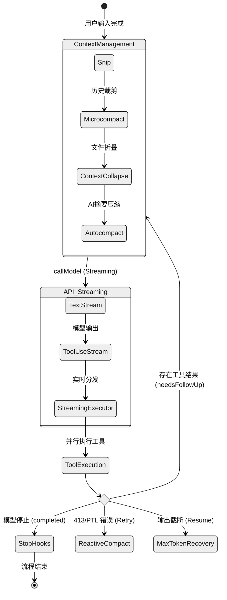

# 03. 请求处理流与状态机深度分析

本报告深入剖析 `claude-code` 的核心请求循环。它不仅是一个简单的 API 调用，而是一个集成了上下文治理、流式工具执行和多级错误恢复的复杂状态机。

## 3.1 核心入口：`QueryEngine.submitMessage`

`QueryEngine` 是对话生命周期的所有者。每次用户输入（或 SDK 调用）都会触发 `submitMessage`，其主要职责是：
1. **输入预处理 (`processUserInput`)**：解析斜杠命令（如 `/ask`, `/plan`），这些命令可能直接修改消息历史或中断后续流程。
2. **环境感知**：通过 `fetchSystemPromptParts` 动态构建 System Prompt，注入当前工作目录、Git 状态、MCP 工具描述等。
3. **上下文持久化**：在进入循环前通过 `recordTranscript` 写入本地存储，确保即便 API 调用失败，会话也是可恢复的。

## 3.2 核心循环：`queryLoop` 状态机

核心逻辑位于 `src/query.ts` 的 `queryLoop` 函数中。它是一个 `while(true)` 循环，驱动着 `Assistant -> Tool Use -> Tool Result -> Assistant` 的状态迁移。

### 3.2.1 状态机视图 (Mermaid)



### 3.2.2 关键阶段的代码级解析

1. **上下文压缩管线 (Pre-Sampling)**:
   - **Snip (`HISTORY_SNIP`)**: 移除历史记录中间的冗余部分。
   - **Microcompact**: 针对大量工具调用结果，通过缓存和合并减少输入 Token。
   - **Context Collapse**: 将长文件内容替换为元数据引用，仅在模型需要时展开。
   - **Autocompact**: 当 Token 接近极限时，调用模型生成历史摘要。

2. **流式工具执行 (`StreamingToolExecutor`)**:
   `claude-code` 支持在模型仍在生成参数时就开始执行工具。
   - `StreamingToolExecutor.addTool()`: 接收模型流出的 `tool_use` 块。
   - `executeTool()`: 异步启动工具，不阻塞模型输出。
   - `getCompletedResults()`: 实时收集已完成的工具结果并 yield 给 UI。

3. **异常恢复机制 (Post-Sampling)**:
   - **Reactive Compact**: 捕获 `prompt_too_long` (413) 错误。如果发生，系统会自动执行一次深度压缩并重试。
   - **Max Output Tokens Recovery**: 如果模型因为 `max_tokens` 停止，系统会注入一个隐式的 "Resume" 消息，引导模型继续输出。
   - **Model Fallback**: 在 `claude.ts` 中通过 `withRetry` 实现。如果 Sonnet 超限，自动降级到 Haiku。

## 3.3 关键 TypeScript 类型定义

```typescript
// src/query.ts 中的内部状态
interface State {
  messages: Message[];
  toolUseContext: ToolUseContext;
  maxOutputTokensOverride?: number;
  maxOutputTokensRecoveryCount: number;
  hasAttemptedReactiveCompact: boolean;
  turnCount: number;
  transition?: {
    reason: 'collapse_drain_retry' | 'reactive_compact_retry' | 'max_output_tokens_recovery' | 'model_fallback' | string;
    [key: string]: any;
  };
}

// 通用的消息模型
type Message = 
  | UserMessage 
  | AssistantMessage 
  | SystemMessage 
  | ToolUseSummaryMessage 
  | TombstoneMessage;

// API 调用参数
export type QueryParams = {
  messages: Message[];
  systemPrompt: SystemPrompt;
  userContext: Record<string, string>;
  canUseTool: CanUseToolFn;
  taskBudget?: { total: number; remaining?: number };
};
```

## 3.4 总结
`claude-code` 的请求处理流并非线性的 Request-Response，而是一个具备**高度防御性**和**并发能力**的循环系统。它通过多层级的压缩策略（Snip -> Micro -> Auto -> Reactive）在极其有限的上下文窗口内维持长对话的智力，同时利用流式执行消除了工具调用带来的等待感。
