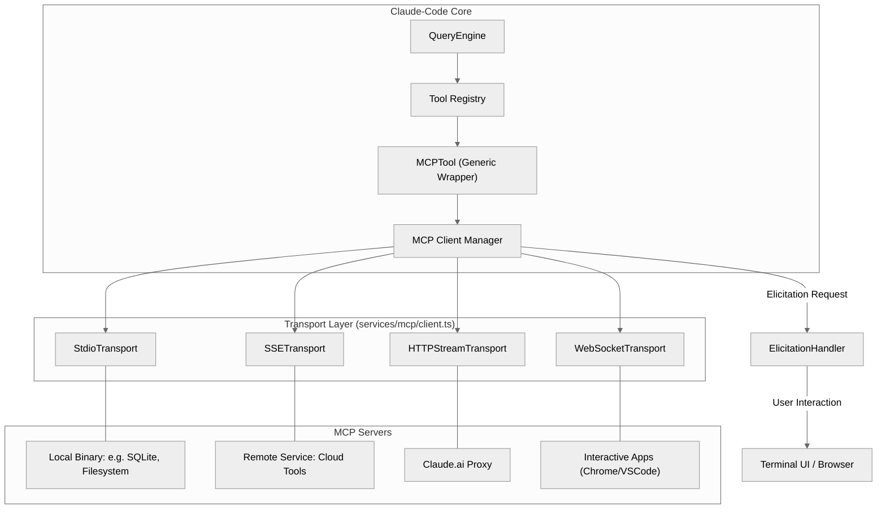

# 07. MCP 协议系统深度分析：连接、扩展与 AI 操作系统的基石

Model Context Protocol (MCP) 是 `claude-code` 实现生态扩展和动态能力注入的核心。它不仅是一个插件协议，更是将 CLI 转变为“AI 操作系统”的标准化接口。

## 7.1. 架构纵览：多层代理模型

`claude-code` 作为一个全功能的 MCP Host，采用了高度模块化的多层代理架构：

## 7.2. 核心实现细节分析

### 7.2.1. 传输层适配 (Transport Layer)
在 `src/services/mcp/client.ts` 中，系统利用 `@modelcontextprotocol/sdk` 并根据配置动态实例化不同的传输方式：

- **Stdio**: 通过 `child_process` 启动。关键点在于对 `stderr` 的监听，用于调试本地服务器崩溃或输出。
- **SSE (Server-Sent Events)**: 用于远程服务，支持长连接和流式更新。
- **Streamable HTTP**: 专为低功耗环境或受限网络设计的请求-响应流。
- **In-Process**: 允许 `claude-code` 内部定义的工具集（如部分内部服务）通过 MCP 协议通信，实现架构统一。
- **SDK Control (SdkControlTransport)**: 专门用于 CLI 进程与 SDK 进程之间的通信。它将 MCP 消息封装在自定义的控制消息中，通过 `stdout/stdin` 跨进程传输，支持 SDK 内部运行的 MCP 服务器。

### 7.2.2. 工具发现与动态代理 (Tool Discovery & Proxying)
MCP 工具的接入是动态的，无需重启 CLI。

1.  **连接与枚举**：调用 `reconnectMcpServerImpl` 时，首先建立连接，随后发送 `tools/list` 请求。
2.  **对象映射**：`fetchToolsForClient` 将服务器返回的 JSON Schema 转换为 `claude-code` 内部的 `Tool` 对象。
3.  **名称隔离**：为了防止名称冲突，所有 MCP 工具默认带有 `mcp__<server_name>__` 前缀。
4.  **调用闭包**：每个动态生成的工具其 `call` 方法最终都会路由到 `callMCPTool` 函数，该函数负责封装 JSON-RPC 请求并处理超时（默认 60s）和进度回调。

### 7.2.3. 启发式交互机制 (Elicitation)
这是 MCP 最具特色的功能，解决了“工具执行中途需要用户决策”的问题。

- **工作流**：
    1.  MCP 服务器在工具执行时发送 `elicit` 请求（JSON-RPC 扩展）。
    2.  `elicitationHandler.ts` 捕获该请求。
    3.  系统根据模式进入不同路径：
        - `url`: 在终端显示链接，引导用户点击，并等待服务器发送 `elicitation_complete` 通知。
        - `form`: 渲染表单，收集用户输入并作为结果写回服务器。
- **典型场景**：OAuth 授权流、双因素认证 (MFA)、或敏感操作的二次确认。

## 7.3. 大规模数据处理：结果持久化 (Persistence)

当 MCP 工具返回的内容过大（超过 Token 限制或 100KB）时，`client.ts` 会自动触发持久化机制：
1.  **自动检测**：通过 `truncateMcpContentIfNeeded` 评估内容长度。
2.  **本地存储**：将结果写入临时文件 `~/.claude/mcp-outputs/...`。
3.  **智能引用**：返回给 AI 一个指令（Large Output Instructions），告诉 AI 结果已存入文件，并建议使用 `file_read` 逐步阅读。这有效解决了上下文窗口溢出的问题。

## 7.4. 典型案例：Chicago (Computer Use)

`Chicago` 是一个高度定制化的 MCP 集成，实现了计算机控制能力：
- **混合传输**：结合了本地 Stdio 服务器和 `InProcessTransport` 以实现极低延迟。
- **权限守卫**：在 `checkPermissions` 阶段注入了专有的“屏幕截图审计”和“按键确认”逻辑。
- **坐标映射**：在 `wrapper.tsx` 中处理从逻辑坐标到物理像素的映射，确保在多显示器环境下的点击准确性。

## 7.5. 关键路径与文件

- `src/services/mcp/client.ts`: 连接池管理、心跳维护及工具代理核心。
- `src/services/mcp/elicitationHandler.ts`: 交互式状态机实现。
- `src/services/mcp/auth.ts`: 复杂的 OAuth 令牌刷新与存储逻辑。
- `src/tools/MCPTool/UI.tsx`: 负责在终端美化渲染 MCP 工具的调用过程和结果。

## 7.6. 总结
MCP 协议让 `claude-code` 不再是一个孤立的终端程序，而是一个能够触达任何本地应用和云端服务的开放生态中心。其强大的传输层适配、灵活的启发式交互以及大数据量下的持久化策略，共同构建了顶级的 AI 工具调用体验。
