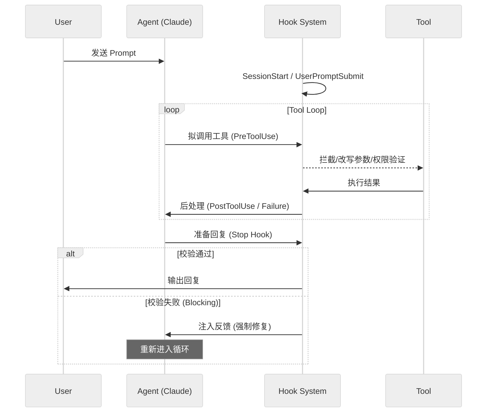

# 09. Hooks 钩子系统深度解析

Hooks 系统是 `claude-code` 实现自动化约束、任务增强和流程干预的核心机制。它通过在对话生命周期的关键节点注入逻辑，实现了 AI 能力与工程规范、安全准则以及自定义工作流的深度融合。

## 9.1. 钩子类型与生命周期 (Code-level)

在 `claude-code/src/types/hooks.ts` 和 `claude-code/src/entrypoints/agentSdkTypes.ts` 中定义了丰富的钩子事件类型。

### 9.1.1. 核心钩子事件类型

| 事件名称 | 触发时机 | 典型用途 |
| :--- | :--- | :--- |
| `SessionStart` | 会话初始化时 | 加载环境变量、同步初始状态、注入项目规范。 |
| `UserPromptSubmit` | 用户提交输入后 | 在发送给 AI 之前进行预处理或注入额外上下文。 |
| `PreToolUse` | 工具执行前 | **权限干预**、参数校验与改写 (updatedInput)。 |
| `PostToolUse` | 工具成功执行后 | 分析执行结果、更新任务进度、注入补充上下文。 |
| `PostToolUseFailure` | 工具执行失败后 | 自动错误诊断、提供修复建议。 |
| `Stop` | AI 尝试结束 turn 前 | **质量关口**：Lint 检查、运行测试、代码风格校验。 |
| `SubagentStart/Stop` | 子代理启动/停止时 | 监控子任务生命周期、汇总子代理输出。 |
| `SessionEnd` | 会话结束/清除时 | 清理临时文件、上传遥测数据、总结会话。 |

### 9.1.2. 钩子执行流



## 9.2. 拦截与决策逻辑 (`utils/hooks.ts`)

Hooks 不仅仅是通知，它们拥有干预流程的能力。

### 9.2.1. 决策机制 (Decision Making)
钩子可以通过返回结构化的 JSON 来控制后续流程：
- **`continue: false`**: 彻底中断当前操作流。
- **`decision: "block"`**: 在 `PreToolUse` 中阻止工具运行，或在 `Stop` 中阻止 turn 结束。
- **`updatedInput`**: (仅 `PreToolUse`) 动态修改 AI 传入工具的参数。例如：自动为 `ls` 命令添加 `-a` 参数。

### 9.2.2. 异步处理与后台运行
在 `executeInBackground` 函数中，系统支持“异步钩子”：
- 如果钩子输出的第一行包含 `{"async": true}`，该钩子将被放入后台执行。
- 即使 AI 开始处理下一个请求，后台钩子仍可继续运行（如长时间的编译或大范围扫描）。
- 异步钩子完成后，可以通过事件总线（`AsyncHookRegistry`）向对话中注入结果。

## 9.3. 关键组件深入分析

### 9.3.1. Stop Hooks：自愈闭环的核心
位于 `src/query/stopHooks.ts` 的 `handleStopHooks` 是系统的“质量守卫”。
- **原理**：当 Claude 认为任务完成并准备退出时，系统并行触发所有已配置的 Stop Hooks。
- **反馈注入**：如果某个钩子返回了 `blockingError`，系统会将此错误作为一条新的 `UserMessage` (标记为 `isMeta`) 注入上下文。
- **自愈过程**：Claude 接收到“测试失败”或“Lint 错误”的反馈后，会意识到任务并未真正完成，从而自动开始修复代码，直到所有钩子通过。

### 9.3.2. 权限与安全干预
在 `services/tools/toolHooks.ts` 中，`resolveHookPermissionDecision` 处理了钩子对工具执行权限的影响：
- 钩子可以明确返回 `allow` 以绕过某些交互式确认。
- **安全降级预防**：即使钩子返回 `allow`，系统仍会通过 `checkRuleBasedPermissions` 检查 `settings.json` 中的硬性约束，确保钩子不能越权。

### 9.3.3. 成本追踪与报告 (`cost-tracker.ts` & `costHook.ts`)
虽然不是传统的 shell 钩子，但 `costHook.ts` 监听了进程的 `exit` 事件：
- **Token 统计**：通过 `addToTotalSessionCost` 实时累加各模型的输入/输出 Token。
- **USD 换算**：根据 `utils/modelCost.ts` 中的价格表计算实际开销。
- **会话持久化**：在会话结束或切换时，通过 `saveCurrentSessionCosts` 将成本数据记录到项目配置中。

## 9.4. 开发者如何配置 Hooks

### 9.4.1. 简单 Shell 命令
在 `.claude/settings.json` 中配置：
```json
{
  "hooks": {
    "PreToolUse": [
      {
        "matcher": "Bash",
        "command": "echo \"Scanning for secrets...\" && check_secrets.sh"
      }
    ],
    "Stop": [
      {
        "command": "npm test"
      }
    ]
  }
}
```

### 9.4.2. 条件过滤 (If Condition)
钩子支持 `if` 语法，例如只在 `git` 命令执行前触发：
```json
{
  "command": "check_branch.sh",
  "if": "Bash(git *)"
}
```

### 9.4.3. 交互式钩子 (Elicitation)
钩子甚至可以请求用户输入。通过 `promptRequestSchema`，钩子可以向 UI 发送弹窗或选择请求，等待用户交互后再继续执行。

## 9.5. 总结
Hooks 系统将 `claude-code` 从一个简单的对话界面转变为一个受控的工程代理。它不仅提供了高度的可扩展性，更通过 `Stop Hooks` 的反馈循环，实现了 AI 修改代码的“确定性”和“鲁棒性”。
