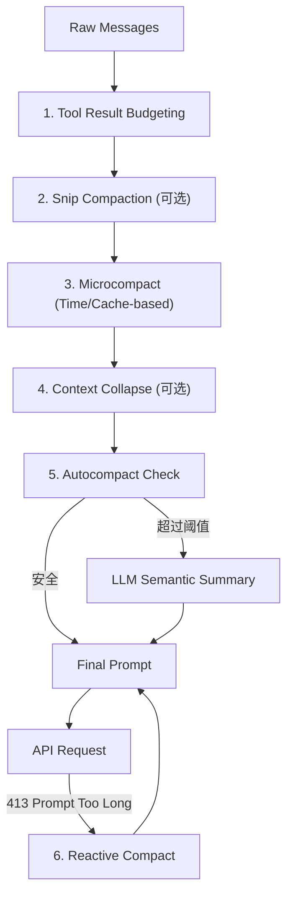

# 10. 上下文管理与多级压缩系统深度解析

在处理复杂工程任务时，LLM 的上下文窗口（Context Window）是核心约束。`claude-code` 实现了一套高度精密的多级压缩（Compaction）管线，旨在平衡“记忆完整性”与“Token 效率”。本章将从代码实现视角深度拆解这一系统的运行机制。

## 10.1. 压缩管线全景图

当用户提交一个消息时，系统在发送 API 请求前会依次经过以下六个压缩阶段。这些阶段的设计原则是：从“无损/低损”到“有损”，从“物理裁减”到“语义摘要”。

## 10.2. 六大压缩阶段详解

### 1. 工具结果预算 (Tool Result Budgeting)
- **实现位置**：`src/query.ts` 中的 `applyToolResultBudget` 函数。
- **机制**：在执行 `shell`、`grep` 或 `read_file` 等工具时，如果输出内容超过预设阈值（如 `shell` 为 100k 字符，`read_file` 为 50k），系统会立即将其截断并替换为 `[Content truncated...]` 标记。
- **目的**：防止单次工具输出直接撑爆上下文。

### 2. 物理裁剪 (Snip Compaction)
- **实现位置**：`src/services/compact/snipCompact.ts`。
- **触发条件**：受 `HISTORY_SNIP` 特性开关控制。
- **策略**：直接从物理层面删除历史消息。通常保留 System Prompt（头部）和最新的 $N$ 条交互（尾部），将中间的部分直接“切除”。
- **优势**：计算成本几乎为零，且 `snipTokensFreed` 会反馈给后续的 Autocompact 逻辑，避免重复压缩。

### 3. 微压缩 (Microcompact)
- **实现位置**：`src/services/compact/microCompact.ts`。
- **策略 A (Time-based)**：如果距离最后一次对话已超过 60 分钟（缓存已失效），则主动清空旧的工具执行结果（替换为 `[Old tool result content cleared]`），以减小下次 prefix-rewrite 的压力。
- **策略 B (Cached - 蚂蚁金服内部专用)**：利用 **Cache Editing API**。在不改变客户端消息历史的前提下，直接在服务端缓存中删除特定的 `tool_result` 块。这实现了真正的“无感无损”压缩。

### 4. 上下文折叠 (Context Collapse)
- **实现位置**：`src/services/contextCollapse/`。
- **核心逻辑**：将大段结构化数据（如读取的文件内容）移动到侧边存储，在主上下文中仅保留一个摘要引用。AI 仍知道文件内容存在，但在需要时才通过引用重新拉取。

### 5. 自动语义摘要 (Autocompact)
这是最关键的有损压缩阶段。
- **实现位置**：`src/services/compact/autoCompact.ts`。
- **触发阈值算法**：
  - `EffectiveWindow = ModelContextWindow - 20,000 (Summary Buffer)`
  - `Threshold = EffectiveWindow - 13,000 (Safety Buffer)`
- **逻辑流**：
  1. 预估当前 Token 总量（使用 4/3 膨胀系数进行保守估算）。
  2. 若超过阈值，启动 Forked Agent（后台进程）。
  3. 调用 LLM 将需要压缩的历史通过 `getCompactPrompt` 指令归纳为一段“连续的叙事摘要”。
  4. 生成 `CompactBoundary` 标记，替换掉旧消息，作为新的“记忆锚点”。

### 6. 响应式抢救 (Reactive Compact)
- **实现位置**：`src/services/compact/reactiveCompact.ts`。
- **触发场景**：API 返回 `413 Prompt Too Long` 错误（通常是因为模型预测的 Token 数与实际计算有偏差）。
- **策略**：捕获异常后，立即执行一次更激进的 `truncateHeadForPTLRetry`（通常丢弃最旧的 20% 消息组），然后自动重试，确保用户任务不中断。

## 10.3. Token 预算与追踪模型

系统通过 `src/utils/tokens.ts` 维护了一套精密且保守的 Token 估算模型：

| 关键参数 | 数值/公式 | 说明 |
| :--- | :--- | :--- |
| **估算系数** | `ceil(chars * 4/3)` | 当没有 API 精确统计时，采用 4/3 膨胀系数以确保不溢出。 |
| **Circuit Breaker** | 3 次尝试 | 自动压缩连续失败 3 次后熔断，防止无限消耗 API 额度。 |
| **Blocking Limit** | `EffectiveWindow - 3k` | 强制拦截。当极其接近窗口上限时，禁止用户输入，必须手动 `/compact`。 |
| **Output Reserve** | 20,000 Tokens | 始终为 LLM 的输出保留足够空间，避免在生成结果时被截断。 |

## 10.4. 代码流分析：如何保持记忆？

在 `src/services/compact/compact.ts` 中，`buildPostCompactMessages` 确保了压缩后的上下文结构：

1. **Compact Boundary**：一个特殊的系统消息，包含元数据（如压缩前的 Token 数、被压缩掉的消息 UUID 范围）。
2. **Summary Messages**：由 LLM 生成的语义摘要，作为后续对话的背景知识。
3. **Restored Files**：系统会自动恢复最近修改的 $N$ 个文件内容到上下文中（`POST_COMPACT_MAX_FILES_TO_RESTORE = 5`），确保开发者正在进行的工作不会因为压缩而丢失细节。
4. **Skill Attachments**：保留已发现的技能和指令。

## 10.5. 总结

`claude-code` 的上下文压缩系统不是简单的“过期删除”，而是一个**动态的生命周期管理系统**。它通过物理、微观、语义和响应式四个维度的层层过滤，使得 AI 能够胜任长达数天、涉及数千次交互的超级长序列任务，是其工业级生产力的基石。
