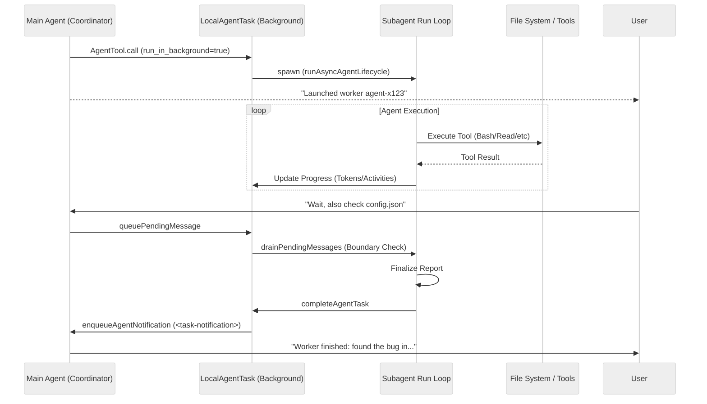

# 16. 子代理与任务协同系统深度分析

在 `claude-code` 中，任务协同系统（Agent Swarms & Tasks）是其处理复杂工程问题的核心。它允许主智能体将任务分解并分发给多个独立的子代理执行，支持同步阻塞、异步后台、上下文继承（Fork）以及隔离环境（Worktree）等多种模式。

## 16.1. 核心架构设计

系统的设计核心在于**解耦**：将 AI 的“思考/执行”逻辑与终端的“交互/显示”逻辑分离。

### 16.1.1. 任务模型 (The Task Model)
所有后台操作都被抽象为 `Task`。核心定义位于 `claude-code/src/Task.ts`：
- **`LocalAgentTask`**: 本地子代理任务，由 `AgentTool` 触发。
- **`LocalMainSessionTask`**: 主会话后台化（按下 `Ctrl+B` 时）。
- **`RemoteAgentTask`**: 远程云端执行的任务。
- **`InProcessTeammateTask`**: 进程内协同队友。

### 16.1.2. 状态管理 (AppState)
任务状态维护在全局 `AppState.tasks` 字典中，每个任务包含：
- `status`: `pending`, `running`, `completed`, `failed`, `killed`。
- `progress`: 实时追踪 Token 消耗、工具调用次数及最近活动（Recent Activities）。
- `outputFile`: 任务输出日志路径（通常是 JSONL 格式的会话记录）。

## 16.2. 上下文隔离机制

为了支持多个代理并发运行而不产生干扰，`claude-code` 采用了两层隔离：

### 16.2.1. 逻辑隔离：AsyncLocalStorage
由于 Node.js 是单线程的，并发运行的子代理共享相同的全局状态。`claude-code` 使用 `AsyncLocalStorage`（位于 `src/utils/agentContext.ts`）来确保每个异步执行链都能访问到正确的代理上下文（`SubagentContext`）。

```typescript
// src/utils/agentContext.ts
const agentContextStorage = new AsyncLocalStorage<AgentContext>()

export function runWithAgentContext<T>(context: AgentContext, fn: () => T): T {
  return agentContextStorage.run(context, fn)
}
```

这避免了参数透传（Parameter Drilling），使得埋点监控、日志记录等逻辑能自动获取当前是哪个代理在工作。

### 16.2.2. 数据隔离：独立 Transcript
每个子代理拥有独立的会话历史文件。通过 `getAgentTranscriptPath(taskId)` 生成，确保即使主会话被清理，子代理的执行细节依然可追溯。

## 16.3. 代理委派模型 (Delegation Models)

`claude-code` 支持两种主要的委派模式：

### 16.3.1. 协同模式 (Coordinator Model)
在 `CLAUDE_CODE_COORDINATOR_MODE=1` 时开启。主代理扮演“管理者”，明确地生成（Spawn）和管理“工人”（Workers）。

- **Spawn**: 使用 `AgentTool({ subagent_type: "worker" })`。
- **Continue**: 使用 `SendMessage({ to: "agent-id" })`。由于工人不共享主会话上下文，必须通过 `SendMessage` 将主代理的合成指令（Synthesis）发给工人。
- **Stop**: 使用 `TaskStopTool`。

### 16.3.2. 分叉模式 (Fork Model) - 实验性
当未指定 `subagent_type` 且开启 `FORK_SUBAGENT` 时触发。
- **上下文继承**: 子代理通过 `buildForkedMessages` 继承主代理的**完整**会话历史。
- **提示词缓存优化**: 为了最大化 Prompt Cache 命中率，Fork 模式会将历史中的 `tool_use` 结果替换为统一的占位符（Placeholder），仅在末尾添加新的指令。

## 16.4. 工作流隔离 (Worktree Isolation)

对于涉及大规模文件修改的任务，子代理可以使用 `isolation: "worktree"` 参数。
1. **创建 Worktree**: 调用 `git worktree add` 创建一个临时的隔离副本。
2. **执行任务**: 子代理在该路径下运行，所有的 `Bash`、`Read`、`Write` 操作都被重定向。
3. **合并/清理**: 任务完成后，如果代码有变动，系统会提示用户，并保留或删除该 Worktree。

## 16.5. 通信与通知循环

子代理与主会话之间的通信是非对称的：
1. **注入指令**: 用户在主终端输入的追问通过 `queuePendingMessage` 进入队列，子代理在“工具轮次边界”（Tool-round boundary）检查并排空（Drain）队列。
2. **结果回传**: 当子代理完成时，通过 `enqueueAgentNotification` 发送一个包含 `<task-notification>` XML 的消息。主代理接收到该“用户角色”的消息后，解析结果并向用户汇报。

### 任务生命周期序列图



## 16.6. 总结

`claude-code` 的任务系统不仅是简单的后台化，它是一套完整的 AI 编排层。通过 `AsyncLocalStorage` 解决并发状态冲突，通过 `TaskNotification` 规范通信协议，通过 `Worktree` 提供安全沙箱，最终实现了高效的“智能体群”协作体验。
